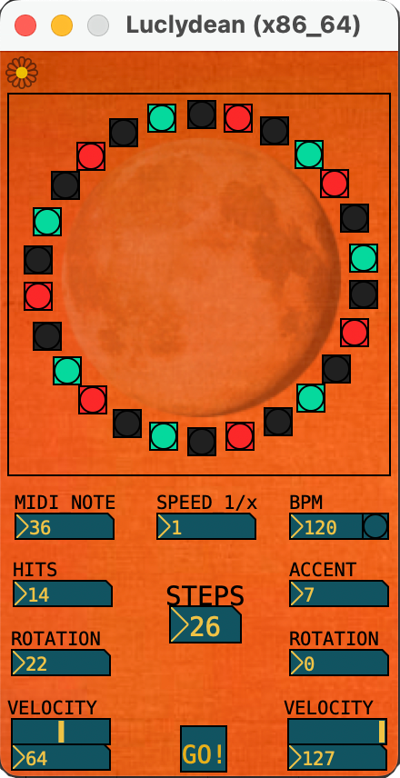

# Luclydean

VST Euclidean Step Sequencer.\
Made with Pure Data (a.k.a. PD) and Camomille.

&nbsp;

&nbsp;
## Features:
* VST Plug-in
* MIDI note selector
* 64 steps sequencer
* Hits, rotation and accent controls
* BPM sync with the DAW
* Clock multiplier
* Key Velocity controls (0-127)
* 9 DAW parameters

&nbsp;

Video Link:\
https://youtu.be/8HPVdJOle2M 

&nbsp;

